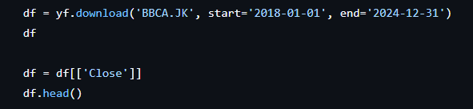
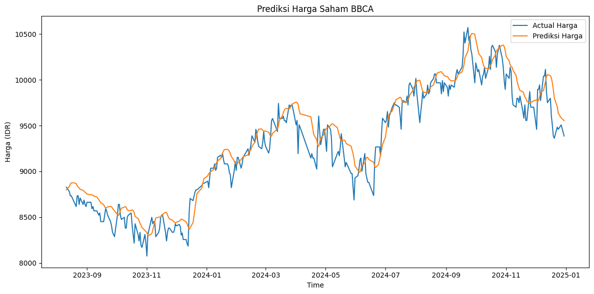

# Prediksi Harga Saham BBCA Menggunakan LSTM

   
  
    Photo by <a href="https://unsplash.com/@nampoh?utm_content=creditCopyText&utm_medium=referral&utm_source=unsplash">Maxim Hopman</a> on <a href="https://unsplash.com/photos/red-and-blue-light-streaks-fiXLQXAhCfk?utm_content=creditCopyText&utm_medium=referral&utm_source=unsplash">Unsplash</a>
 

## Deskripsi Proyek
Proyek ini bertujuan untuk melakukan prediksi harga penutupan saham BBCA (PT Bank Central Asia Tbk) menggunakan model Long Short-Term Memory (LSTM),
sebuah jenis Recurrent Neural Network (RNN) yang dirancang untuk menangani data deret waktu (time series). Model dibangun untuk menangkap pola historis dan memprediksi harga penutupan
dalam periode data testing (data historis yang dipisahkan). Proyek ini belum mencakup forecasting ke masa depan, melainkan fokus pada evaluasi akurasi model terhadap data yang sudah ada (backtesting).

## 🛠️ Tools dan Library
- Python
- yfinance
- Numpy & Pandas
- scikit-learn
- Keras (TensorFlow backend)
- Matplotlib

## 📥 Data
Data harga saham BBCA diambil langsung dari Yahoo Finance menggunakan pustaka yfinance. Hanya kolom harga penutupan (Close) yang digunakan untuk pelatihan dan prediksi.

   

## 🔁 Preprocessing
- Data dinormalisasi menggunakan MinMaxScaler.
- Dibuat sliding window dengan time_step = 60 untuk menangkap pola 60 hari sebelumnya.
- Data dipecah menjadi 80% data latih dan 20% data uji, tanpa pengacakan (karena time series).

## 🧠 Arsitektur Model LSTM

   

- Optimizer: Adam
- Loss: Mean Squared Error (MSE)
- Epoch: 20
- Batch Size: 32

## 📈 Hasil Visualisasi

   

Grafik menunjukkan perbandingan antara:
- 🔵 Harga aktual
- 🟠 Harga prediksi dari model

## Kesimpulan
Model mampu menangkap arah tren pergerakan harga, meskipun terdapat deviasi pada titik-titik ekstrem.
Ini menunjukkan bahwa model bekerja cukup baik sebagai baseline prediksi.

## 👩‍💻 Author

**Sinta Miftakhul Rohmah**  
Applied Mathematics student  
Universitas Islam Negeri Sunan Kalijaga, Yogyakarta  
📫 [LinkedIn](https://www.linkedin.com/in/sintamiftakhulr/)
